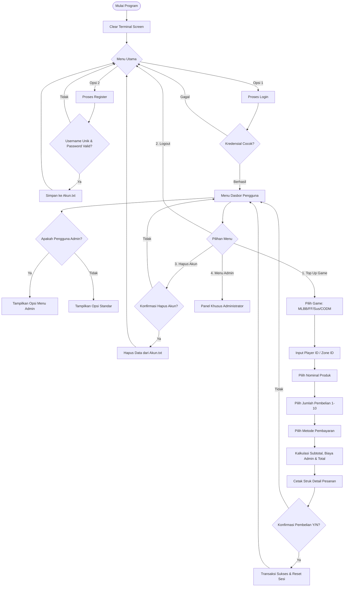

<div align="center">

# 🎮 Winanda Store — Game Top Up CLI
### Sistem Simulasi Transaksi Top Up Game Online Berbasis Command Line Interface (CLI).

<p align="center">
  
</p>

<p align="center">
  <strong>Aplikasi Command Line Interface (CLI) Interaktif untuk Simulasi Transaksi Top Up Multi-Game, Manajemen Akun, dan Role-Based Access Control.</strong>
</p>

<p align="center">
  <a href="https://www.python.org/downloads/"></a>
  <a href="#-teknologi-dan-arsitektur"></a>
  <a href="https://github.com/winanda150/game-topup-cli"></a>
</p>

</div>

## 📖 Tentang Proyek

**Winanda Store Game Top Up CLI** adalah aplikasi simulasi *e-commerce* top up voucher game online berbasis terminal (*Command Line Interface*). Dibangun murni menggunakan **Python 3 Standard Library**, aplikasi ini dirancang untuk mensimulasikan alur transaksi digital *end-to-end* yang realistis — mulai dari registrasi akun, proteksi autentikasi kata sandi, validasi ID pemain lintas game, kalkulasi subtotal dan biaya penanganan (*handling fee*), hingga penerbitan struk transaksi (*digital invoice*).

---

## ✨ Fitur Utama

| Modul | Fitur | Deskripsi |
| :--- | :--- | :--- |
| **Autentikasi** | 🔐 Register Akun | Validasi keunikan username, konfirmasi kata sandi ganda, dan penyimpanan otomatis ke berkas database. |
| | 🔑 Login Terproteksi | Masking kata sandi dengan modul `getpass` dan validasi kecocokan kredensial. |
| | 🚪 Logout Bersih | Pengakhiran sesi aktif dan pembersihan memori transaksi. |
| | 🗑️ Self-Service Hapus Akun | Fitur penghapusan akun mandiri dengan konfirmasi eksplisit (*two-step confirmation*). |
| **Transaksi** | 🎮 Multi-Game Engine | Dukungan 4 game populer dengan validasi format ID pemain dan zona unik tiap game. |
| | 📦 Variasi Produk Luas | Pilihan paket mulai dari satuan Diamond mikro, Goldstar, CP, hingga Pass mingguan/bulanan. |
| | 🔢 Pembelian Multi-Qty | Dukungan pembelian 1 hingga 10 item sekaligus dalam satu transaksi dengan kalkulasi otomatis. |
| | 🧾 Faktur / Struk Detail | Rincian lengkap harga satuan, subtotal, biaya admin per metode pembayaran, dan grand total. |
| **Manajemen** | 👑 Role-Based Admin | Menu eksklusif untuk akun administrator terdaftar guna melihat seluruh pengguna dan daftar admin. |
| **User Experience** | ⏱️ Simulasi Latensi Realistis | Jeda waktu (*animated delay*) menggunakan `time.sleep` untuk memberikan kesan pemrosesan server nyata. |

---

## 🎯 Game & Katalog Layanan

Aplikasi ini mendukung katalog harga terintegrasi untuk 4 judul game terpopuler:

<details open>
<summary><b>1. ⚔️ Mobile Legends: Bang Bang (MLBB)</b></summary>
<br>

* **Input Data:** User ID & Zone ID
* **Daftar Paket & Harga:**

| No | Paket Top Up | Kategori | Harga (IDR) |
| :-: | :--- | :--- | :--- |
| 1 | 1x Weekly Diamond Pass | Subscription | Rp 26.000 |
| 2 | 3x Weekly Diamond Pass | Subscription | Rp 78.000 |
| 3 | 5x Weekly Diamond Pass | Subscription | Rp 130.000 |
| 4 | Twilight Pass | Exclusive Pass | Rp 150.000 |
| 5 | 5 Diamond | Reguler | Rp 1.500 |
| 6 | 44 Diamond | Reguler | Rp 12.000 |
| 7 | 85 Diamond | Reguler | Rp 22.000 |
| 8 | 170 Diamond | Reguler | Rp 44.000 |
| 9 | 296 Diamond | Reguler | Rp 76.000 |
| 10 | 408 Diamond | Reguler | Rp 105.000 |
| 11 | 568 Diamond | Reguler | Rp 143.000 |
| 12 | 875 Diamond | Reguler | Rp 219.000 |
| 13 | 2010 Diamond | Jumbo Pack | Rp 475.000 |

</details>

<details>
<summary><b>2. 🔫 Free Fire Max</b></summary>
<br>

* **Input Data:** Player ID
* **Daftar Paket & Harga:**

| No | Paket Top Up | Harga (IDR) |
| :-: | :--- | :--- |
| 1 | 5 Diamond | Rp 1.500 |
| 2 | 50 Diamond | Rp 10.000 |
| 3 | 140 Diamond | Rp 20.000 |
| 4 | 355 Diamond | Rp 45.000 |
| 5 | 720 Diamond | Rp 90.000 |
| 6 | 1450 Diamond | Rp 180.000 |
| 7 | 2180 Diamond | Rp 270.000 |
| 8 | 3640 Diamond | Rp 450.000 |

</details>

<details>
<summary><b>3. 🚀 Super Sus</b></summary>
<br>

* **Input Data:** Space ID
* **Daftar Paket & Harga:**

| No | Paket Top Up | Kategori | Harga (IDR) |
| :-: | :--- | :--- | :--- |
| 1 | 100 Goldstar | Reguler | Rp 10.000 |
| 2 | 310 Goldstar | Reguler | Rp 35.000 |
| 3 | 520 Goldstar | Reguler | Rp 57.000 |
| 4 | 1060 Goldstar | Reguler | Rp 117.000 |
| 5 | 2180 Goldstar | Reguler | Rp 240.000 |
| 6 | 5600 Goldstar | Jumbo Pack | Rp 613.000 |
| 7 | Super Pass | Pass | Rp 73.000 |
| 8 | Super Pass Bundle | Pass Bundle | Rp 128.000 |
| 9 | Weekly Card | Membership | Rp 13.000 |
| 10 | Monthly Card | Membership | Rp 134.000 |
| 11 | Super VIP Card | VIP Membership | Rp 157.000 |

</details>

<details>
<summary><b>4. 🎖️ Call of Duty: Mobile (CODM)</b></summary>
<br>

* **Input Data:** Player ID
* **Daftar Paket & Harga:**

| No | Paket Top Up (CP) | Harga (IDR) |
| :-: | :--- | :--- |
| 1 | 63 CP | Rp 10.000 |
| 2 | 128 CP | Rp 18.000 |
| 3 | 321 CP | Rp 45.000 |
| 4 | 645 CP | Rp 90.000 |
| 5 | 1373 CP | Rp 180.000 |
| 6 | 2060 CP | Rp 270.000 |
| 7 | 3564 CP | Rp 450.000 |
| 8 | 7656 CP | Rp 900.000 |

</details>

---

## 💳 Metode Pembayaran & Skema Biaya

Sistem menerapkan transparansi biaya dengan menetapkan *biaya penanganan transaksi* secara otomatis sesuai kanal pembayaran yang dipilih:

```
[ Grand Total ] = ( Harga Satuan × Kuantitas ) + Biaya Penanganan
```

| ID | Metode Pembayaran | Tipe Kanal | Biaya Penanganan (Admin) |
| :-: | :--- | :--- | :--- |
| **1** | **QRIS** | Digital / E-Wallet Instant | `Rp 850` |
| **2** | **Kartu Kredit** | Payment Gateway Card | `Rp 2.050` |
| **3** | **Virtual Account** | Automated Bank VA | `Rp 2.550` |
| **4** | **Bank Transfer** | Manual / Direct Transfer | `Rp 1.500` |

---

## 👑 Hak Akses & Panel Administrator

Aplikasi ini mengimplementasikan sistem **Role-Based Access Control (RBAC)** dinamis. Saat pengguna yang terdaftar pada daftar `list_admin` berhasil login, antarmuka utama akan secara otomatis membuka akses ke **Menu Admin** (Opsi 4).

### Fitur Panel Admin:
1. **Lihat Semua Akun:** Mengiterasi dan menampilkan seluruh daftar username yang terdaftar di basis data `Akun.txt`.
2. **Lihat Akun Admin:** Memfilter dan hanya menampilkan akun-akun terdaftar yang memiliki status administrator.
3. **Navigasi Kembali:** Opsi kembali ke dasbor utama secara aman.

---

## 🏗️ Arsitektur & Alur Program

Berikut adalah diagram alur logika aplikasi (*Flowchart Execution Lifecycle*):



---

## 📂 Struktur Direktori

```text
game-topup-cli/
├── .github/
│   └── Screenshot (211).png     # Aset banner / preview antarmuka aplikasi
├── Akun.txt                     # Basis data pengguna (format: username,password)
├── Program Top Up.py            # Kode program utama (Source Code Utama)
└── README.md                    # Dokumentasi komprehensif proyek
```

---

## 💻 Teknologi dan Arsitektur

Proyek ini dibangun menggunakan arsitektur **Zero-Dependency** sehingga dapat langsung dijalankan pada lingkungan Python mana pun tanpa memerlukan `pip install`.

* **Runtime:** Python 3.8 / 3.9 / 3.10 / 3.11 / 3.12+
* **Modul Standar (Built-in Modules):**
  * `os` — Operasi sistem untuk manipulasi terminal (`cls` / `clear`).
  * `time` — Simulasi latensi dan jeda waktu antar menu (*UX smoothing*).
  * `getpass` — Pengamanan input kata sandi tanpa menampilkan karakter ke layar terminal (*secure password input*).

---

## 🚀 Panduan Instalasi & Menjalankan

### 1. Prasyarat Sistem
Pastikan Python 3 sudah terpasang di komputer Anda. Periksa instalasi dengan perintah:
```bash
python --version
# atau
python3 --version
```

### 2. Kloning Repositori
Unduh repositori ini ke komputer lokal Anda:
```bash
git clone https://github.com/winanda150/game-topup-cli.git
```

### 3. Masuk ke Direktori Proyek
```bash
cd game-topup-cli
```

### 4. Eksekusi Program
Jalankan file program utama melalui terminal:
```bash
# Windows
python "Program Top Up.py"

# Linux / macOS
python3 "Program Top Up.py"
```

---

## 🔐 Akun Uji Coba (Demo Accounts)

Untuk mempermudah pengujian seluruh fitur dan hak akses, berikut daftar akun bawaan yang telah tersedia di `Akun.txt`:

| Username | Password | Role / Hak Akses | Keterangan |
| :--- | :--- | :--- | :--- |
| `Winanda` | `111` | **👑 Administrator** | Memiliki akses penuh ke Menu Admin & Top Up |
| `Gustadi` | `118` | **👑 Administrator** | Memiliki akses penuh ke Menu Admin & Top Up |
| `Reva` | `172` | **👑 Administrator** | Memiliki akses penuh ke Menu Admin & Top Up |

---

## 🤝 Panduan Kontribusi

Kontribusi selalu diterima dengan senang hati! Jika Anda ingin berkontribusi:

1. Fork repositori ini.
   ```bash
   https://github.com/winanda150/game-topup-cli/fork
   ```
2. Buat branch fitur baru Anda:
   ```bash
   git checkout -b feature/FiturKerenBaru
   ```
3. Lakukan perubahan dan commit:
   ```bash
   git commit -m "feat: Menambahkan fitur diskon promo kode"
   ```
4. Push ke branch Anda:
   ```bash
   git push origin feature/FiturKerenBaru
   ```
5. Buka **Pull Request** pada repositori ini.

---

## 👨‍💻 Pengembang

<div align="left">
  <table>
    <tr>
      <td align="center">
        <a href="https://github.com/winanda150">
          <br />
          <sub><b>I Wayan Winanda</b></sub>
        </a><br />
        <sub>Lead Developer & Author</sub><br />
        <a href="https://github.com/winanda150">💻 GitHub</a>
      </td>
    </tr>
  </table>
</div>

<div align="center">
  <small>Made with ❤️ by <b>WinandaDev</b> • &copy; 2026 All Rights Reserved</small>
</div>